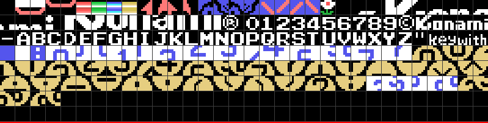
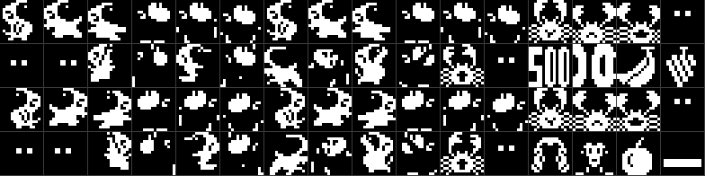

# El cartucho

## La cabecera y la máquina

Los 16384 bytes empiezan por `AB`: la BIOS los reconoce como cartucho, los
mapea en la página 1 (0x4000-0x7FFF) y, cuando acaba de arrancar la máquina,
llama al punto de entrada de la cabecera, **0x40AF**. STATEMENT, DEVICE y
TEXT van a cero. Los cinco talones de ocho bytes que siguen a la cabecera
(`pop hl / ld (0),hl / ret`) no los usa nadie: son el relleno de los ganchos
que la cabecera deja vacíos.

INIT (0x40AF) deshabilita interrupciones, escribe `jp 0x4038` en el gancho
H.KEYI (0xFD9A), pone la pila en 0xE400, carga la memoria de vídeo, borra la
RAM del juego, habilita las interrupciones y se queda en un `jr $` de dos
bytes (0x419B). A partir de ahí **todo el juego corre dentro de la
interrupción**, un paso por fotograma. 0xE005 es el candado: si un paso
tarda más de un fotograma, la interrupción siguiente toca la música, vuelca
los sprites y se va.

## La memoria de vídeo

SCREEN 2 con sprites de 16×16 (0x488C: R0=02, R1=A2, R2=0E, R3=7F, R4=07,
R5=76, R6=03, R7=E1).

| VRAM | qué hay |
|---|---|
| 0x0000 | los colores de los tiles, tres tercios iguales |
| 0x1800 | los patrones de los 64 sprites |
| 0x2000 | los patrones de los tiles, tres tercios iguales |
| 0x3800 | la tabla de nombres |
| 0x3B00 | los atributos de sprites |

Los tiles 0x00-0xB7 vienen comprimidos: los patrones en 0x5156 (0x515 bytes)
y los colores en 0x566B (84 bytes), los dos con el mismo RLE (0x6C84: 0 fin;
n < 0x80 repite n veces el byte siguiente; n ≥ 0x80 copia n & 0x7F bytes tal
cual). Descomprimidos dan 1472 bytes cada uno, exactamente 184 tiles, y los
dos bloques cierran donde empieza el siguiente. Los tiles 0xB8-0xC3 los carga
después 0x4728 desde 0x5EFF: son las piezas de las cifras grandes de la
ecuación que no cabían en el primer bloque, y comparten número con el rótulo
del título, que se dibuja en los tiles 0xB8-0xFF fila de pixels a fila de
pixels (0x4C77).

De los tiles: 0x00 vacío, 0x01-0x04 el canto de las tarjetas, 0x05-0x08 las
cuatro barras de plataforma (una por color), 0x09-0x0C la flecha roja,
0x0D-0x14 las caras del mono del panel (normal y llorando), 0x15 la flor,
0x16-0x2F el KONAMI grande, 0x30-0x5B cifras, ©, letras y guión en ASCII,
0x5C-0x5F "key" y "with" en letra pequeña, 0x60 azul, 0x61-0x7A las
tarjetas con sus cifras, 0x7B-0xB7 las cifras y signos grandes.

## Los sprites

INIT copia a 0x1800 los seis primeros sprites de 0x56BF, y luego los 22 del
mismo bloque **otra vez** a partir de 0x18C0, porque COPIA_A_VRAM deja HL como
estaba (0x40CF). Así el sprite n de la VRAM, para n de 6 a 27, es el n − 6 del
cartucho: por eso el mono está en los patrones 0x00 y 0x18, y el cangrejo en
0x30. Los mismos 22 se espejan bit a bit (0x4107) y van a 0x1CC0: el espejo
del sprite k es el patrón 0x98 + 4k. Aparte, 0x597F (500, 100, plátano y
uvas) a 0x1B80, 0x59FF (el mono andando hacia la izquierda, dibujado aparte)
a 0x1C00 y 0x5ABF (la cara grande, la manzana y la tarjeta) a 0x1F80.

Cada personaje son dos sprites superpuestos: el cuerpo de un color y los
detalles de otro (el mono azul y blanco, el cangrejo rojo y amarillo, el
profesor rojo oscuro y blanco). Y el juego cambia bloques enteros según lo
que lleve el mono: 0x6044 apunta tres juegos —normal, con la fruta en la
cabeza (0x5B3F) y con la tarjeta en alto (0x5BFF)—, y 0x5F80 carga el que
pida 0xE10E en 0x1800 y 0x1C00. Los globos (0x5E3F) pisan el 500 en 0x1B80
mientras la ecuación sube, y la cara grande de 0x5E7F pisa el mono en 0x1800
al entregar la respuesta.

La tabla de sprites vive en 0xE0B0 (24 × 4 bytes) y 0x46BA la vuelca cada
fotograma **empezando por uno distinto cada vez** (0xE1B2 baja de 23 a 0):
así el límite de cuatro sprites por línea del TMS9918 va rotando y ninguno
desaparece siempre.

## El mapa de la RAM

Todo en 0xE000-0xE3FF, borrado por INIT. Lo importante:

| | |
|---|---|
| 0xE000 | el estado del juego, índice de la tabla de 0x4226 |
| 0xE002 | opciones: bit 4 teclado, bit 5 dos jugadores, bit 6 partida en marcha, bit 7 el jugador |
| 0xE008/9 | los mandos, antes y ahora, en formato de joystick |
| 0xE010 | los tres canales de sonido, 10 bytes cada uno |
| 0xE040 | el récord; 0xE043 y 0xE046 los puntos de cada jugador (BCD, 6 cifras) |
| 0xE050 | el jugador en juego: vidas, fase, vida extra, ecuación nueva, resueltas, tiempo, fallos, símbolos; 0xE080 la copia del otro |
| 0xE0B0 | la tabla de sprites: 0-1 el mono, 2-7 los cangrejos, 8-9 el profesor, 10-17 las frutas, 18 la tarjeta |
| 0xE108 | los cuatro actores, 8 bytes cada uno, que el código lee desde su sprite como IX+0x58 |
| 0xE140 | la semilla del azar |
| 0xE142 | el resultado de la ecuación; 0xE144 la ecuación en símbolos |
| 0xE15A | las diez tarjetas de la fase (Y, X) |
| 0xE1AF | la tarjeta que lleva el mono (0xFF ninguna) |
| 0xE1B5 / 0xE1C1 | la ecuación de cada jugador; 0xE1CD/E la cifra escondida |
| 0xE1E4 / 0xE20E | las tarjetas de cada jugador: estado y cifra |
| 0xE24C | el estado de cada globo |
| 0xE260 | las ocho frutas: estado y contador |
| 0xE270, 0xE276 | las banderas de la respuesta y del profesor |

## De qué está hecho

| | bytes |
|---|---|
| código | 8.962 |
| datos | 7.422 |
| sin identificar | 0 |

De los datos: 1.472 + 84 de tiles comprimidos (0x5156, 0x566B), 2.688 de
sprites (0x56BF-0x5F5F), 504 del rótulo del título (0x4CD0), 1.044 de sonido
(0x7A71-0x7E85), 287 de relleno a 0xFF al final, y el resto tablas y listas:
las posiciones de las tarjetas por fase (0x50AE, 21 bytes por fase), las
plataformas (0x6705), las frutas (0x6806, 32 bytes por fase), las flores
(0x6B42), los guiones de ecuación (0x712B), los símbolos (0x7207), los textos
de todos los rótulos y las tablas de los dos despachadores.

Hay cinco trozos de código a los que no salta nadie, sembrados en el trazado
para que salgan como lo que son: `push iy / ret` en 0x4072, un `ld a,0F0h`
en 0x4917 que nadie usa, un pintador de plataformas por lista (0x664F,
0x6624, 0x65F8) que 0x6685 dejó sin trabajo, la entrada de RLE_A_VRAM que lee
la dirección delante de los datos (0x6C80) y nueve bytes en 0x755C que caen
en 0x7565.
