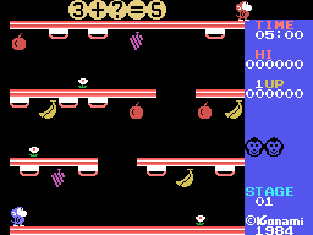

# El juego

Un mono en una escuela de tres pisos, una cuenta con una cifra tapada, diez
tarjetas colgadas de las plataformas y cangrejos que van a por él. Todo lo de
esta página sale de leer el código que lo hace y de medirlo en el emulador.

## La pantalla

Arriba, la ecuación en cifras grandes de 2×2 tiles (0x7207), con un `?` en
la cifra que hay que encontrar. Debajo, cuatro plataformas —el suelo, la de
arriba y dos entre medias, con huecos— y colgadas de ellas las diez tarjetas
de la fase, que se ven solo por el canto (el 2×2 rojo de 0x5082). Ocho frutas
cuelgan también, tres flores adornan, y a la derecha el panel: TIME, HI, los
puntos, las vidas, STAGE y el ©Konami 1984.

Arriba a la derecha pasea el profesor, que es el mismo sprite del mono en rojo
oscuro (0x7ED9). Va de 0xB8 a 0xE8 y vuelve, cada dos fotogramas un pixel.

## Qué hay que hacer

1. Ponerte debajo de una tarjeta y saltar: si el canto está justo encima
   (0x6A1F mira el tile en Y+7, X+8), la tarjeta baja tres filas y enseña su
   cifra. Bajas con ella (estado 5) y la llevas cogida (0xE1AF).
2. Con el segundo botón (SELECT, o el 0x20 del guión de la demo) respondes:
   la tarjeta parpadea cinco veces (0x7760) y su cifra se compara con la
   escondida (0xE1CD). Si acierta, 500 puntos, sonido 0x95 y la tarjeta se
   cierra y **cae al suelo** (0x7899, 0x787E) como un sprite plano amarillo
   (0xFC). Si falla, una cara llorando más en el panel (0xE057) y sonido
   0x0E; **al tercer fallo** un mono cyan entra por la izquierda colgado de un
   globo, se pone bajo el `?`, el globo sube y la cifra se revela (0x6D27):
   pierdes la vida.
3. Recoger la tarjeta caída (0x6ABB): el mono la lleva en alto (juego de
   sprites 2, 0x5BFF) y una flecha roja parpadea en la fila 6, columna 23
   (0x6CA6): hay que subírsela al profesor.
4. Tocar al profesor con ella (0x6ADB): la tarjeta sube sola hasta arriba, 500
   puntos más, el profesor la lleva andando hasta el `?` y la escribe (0x74D5),
   vuelve a su sitio y los dos se ponen a bailar con la cara grande (0x6DFC).
   Tres ecuaciones así y la fase está superada: el tiempo que queda se
   convierte en puntos, 10 por segundo (0x77ED).

Entre medias, los cangrejos.

## Moverse

Izquierda y derecha andan (estado 2, un pixel por paso, sonido 3 cada
cuatro). El botón de disparo salta: sin dirección, en vertical (estado 3, la
tabla de 24 desplazamientos de 0x6423: sube 3 3 3 2 1 1 1 0 1 0 1 0 y baja
0 1 0 1 0 1 1 1 2 3 3 3, uno cada dos fotogramas); con dirección y a más de
12 pixels del borde, hacia arriba por un hueco (estado 4): trepa cuatro
pixels por fotograma moviéndose un pixel al lado, y si encuentra plataforma a
menos de 17 pixels por encima que le cubra (0x696B) se sube. Si no, cae. Al
salirte de una plataforma por el borde caes (estado 6), cuatro pixels por
fotograma.

No hay escaleras: se sube por los huecos y se baja por los bordes.

## Los cangrejos

Tres actores más, con el mismo estado que el mono (0x602E) y su tipo en el
nibble bajo de +0x5B: 1, 2 y 3. Los tres empiezan escondidos con
temporizadores de 0x20, 0x40 y 0x60 (0x4B24), aparecen arriba en el centro
(Y = 0x10, X = 0x60), se descuelgan a través de la plataforma de arriba
(estado 7, un pixel cada cuatro fotogramas mientras el tile no esté vacío) y
caen al primer suelo.

- **El tipo 1** anda hasta un borde y se cae.
- **El tipo 2** en el borde lo piensa: la mitad de las veces se cae y la otra
  mitad da la vuelta.
- **El tipo 3** es el único que salta (0x616F: cuando el azar de 0xE140 sale a
  cero se pone el bit 4, que para un cangrejo es el disparo), y por eso el
  único que puede coger una fruta colgada y tirártela.
- **Desde la fase 18** el primero es del tipo 4 (0x47E9: 0x44) y patrulla la
  segunda plataforma: en el borde da la vuelta si está a esa altura (Y = 0x38)
  y si no se deja caer hasta ella.

Cuántos de ellos juegan lo dice la fase (0x4850: fase/8 + 2 actores, el mono
incluido, tope 4): **uno solo hasta la fase 7**, dos en la 8 y la 9, los tres
desde la 10. El bucle de 0x4860 llama a `ACTOR_PASO` con el número de actor
en B, del último al primero; y uno de cada cuatro fotogramas (0xE272) solo se
mueve el mono. Medido en una partida: en las fases 1 y 2 el mono dio 1003
pasos en 1003 fotogramas, el primer cangrejo 752, los otros dos ninguno. Y
cuánto esperan
escondidos antes de volver, (16 - fase) × 16 + 17 fotogramas hasta la fase 19,
uno desde la 20 (0x6585). Al llegar al borde izquierdo del suelo se van por
él (0x61C2).

Si uno te toca a menos de 16 pixels (0x69B0), cara de susto (0x65AE), sonido
0xA0 y una vida menos.

## Las frutas

Ocho por fase (0x6806): manzanas (0xF8), plátanos (0x78) y uvas (0x7C),
colgadas en las filas 3, 10 y 17. Se cogen **saltando** contra ellas
(0x5FA7): 100 puntos, sonido 7, y el mono la lleva en la cabeza (bits 2-3 de
0xE260, juego de sprites 1 con los brazos arriba). Con la fruta en la cabeza
el disparo no salta: la **tira** hacia donde mira (estado 8, 0x64EA), y la
fruta vuela por una de las dos parábolas de 0x742F/0x7451.

Cada ocho pasos mira lo que tiene debajo (0x73E1): **si hay plataforma vuelve al
paso 0 con la parábola que sube y sigue volando**, y solo se pone a caer cuando
debajo ya no hay nada. Las dos parábolas son además la misma tabla leída con 17
bytes de desfase: los mismos dY con el dX cambiado de signo, y el bit 5 del
estado elige el lado.

Una fruta que va por el aire mata a lo que toque: al cangrejo, que se muere
enseñando un "500" blanco durante 0x20 fotogramas (0x5FF5); o al mono, que
pierde la vida (0x5FE8). Los cangrejos del tipo 3 hacen exactamente lo mismo
contigo. Al caer sobre una fruta desde arriba la descuelgas (0x6496), y la
que se sale de la pantalla desaparece.

## El tiempo, las vidas y los puntos

Cada vida empieza con **5:00** en el reloj (0x47E1) y pierde un segundo cada
64 fotogramas (0x6CC6); a menos de diez segundos suena el aviso 0x0C cada
fotograma, y a cero se pierde la vida. Al volver a jugar, si quedaba menos de
0:30 se pone en 0:30 (0x6CEF). Al superar la fase el reloj se descuenta a
puntos, un segundo por cada cuatro fotogramas, y vuelve a 5:00.

Tres vidas (0x47E1). Una más al pasar de 10.000 puntos y después cada 20.000
(30.000, 50.000...; 0x4974: 0xE052 lleva las decenas de millar de la
siguiente, arranca en 0 y sube de 2 en 2), sonido 0x10. Medida: la primera
llegó con 10.260. Puntos: 100 la fruta
cogida, 500 el cangrejo, 500 la respuesta acertada, 500 al entregarla, 10 por
segundo sobrante. El récord se guarda en 0xE040 y se pinta al momento.

## Los niveles

Al empezar la partida, y otra vez tras cada fase superada, aparece el LEVEL
SELECT: teclas 1 a 5 (0x765F), un minuto de espera y sigue con el que
hubiera. Cada jugador elige el suyo (0xE153/0xE154). El nivel es el guión de
la ecuación (0x7117):

| nivel | guión | forma | ejemplo medido |
|---|---|---|---|
| 1 | `0A 0E` | A + B = R | 89+9?=188 |
| 2 | `0B 0E` | A − B = R, con signo si sale negativo | 89−9?=−10 |
| 3 | `0D 0E` | (D × E) ÷ D = E | 72÷?=9 |
| 4 | `0C 0E` | A × b = R, b de una cifra | ?3×3=129 |
| 5 | `0C 10 0A 11 0E` | a × ( b + c ) = R, todo de una cifra | 7×(?+4)=56 |

A y B son de dos cifras en BCD, con las unidades entre 2 y 9. La cifra que se
tapa se elige restando un número al azar de 0 a 15 al **valor** de la primera
cifra de la ecuación (0x7253), así que nunca cae más allá de esa posición:
con un 1 delante el `?` va siempre en el primer operando, y en 400 ecuaciones
muestreadas solo 67 lo llevan en el resultado.

## El título y la demo

Al arrancar el KONAMI sube desde la fila 21 (0x6C42), sale VIDEO CARTRIDGE, y
el rótulo "Monkey Academy" se pinta **fila de pixels a fila de pixels**
(0x4C77) en los tiles 0xB8-0xFF con tres bandas de color. Debajo, PLAY
SELECT: 1 y 2 con joystick, 3 y 4 con teclado, para uno o dos jugadores. Sin
tocar nada, a los 256 fotogramas arranca la demo: la ecuación 3 + ? = 5, con
la cifra 2 escondida, jugada por el guión de 120 bytes de 0x4B78, un mando
cada ocho fotogramas.

Con dos jugadores se alternan al perder la vida (estado 14 intercambia
0xE050-0xE06F con 0xE080-0xE09F), cada uno con su joystick (0x4905 elige el
puerto) y con sus propias tarjetas y su propia ecuación.
